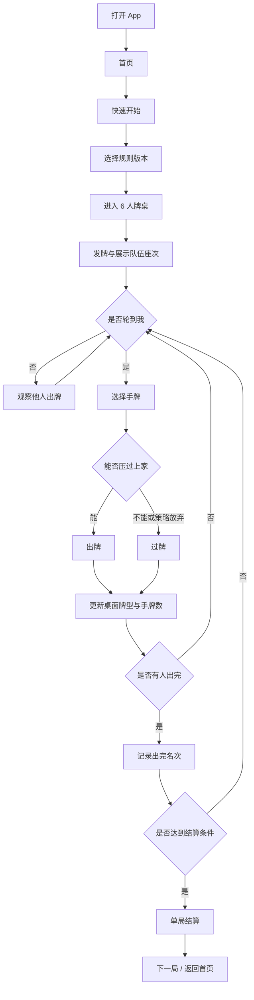

# DoorSix App 端 UI 原型设计

## 1. 原型定位

DoorSix 的核心玩法调整为天津一带的扑克牌游戏“砸六家”，不是点击六扇门的小游戏。

首版 App 原型围绕 6 人牌桌设计：

- 6 名玩家分成两队，每队 3 人
- 队友隔位坐，形成交错座次
- 玩家轮流出牌、过牌，队友之间通过牌局信息配合
- 玩家陆续出完手牌后形成名次
- 一局按出完顺序、被逮人数和本地规则判定胜平负
- 不同地区规则差异较大，App 需要支持规则版本配置

首版建议先做“人机练习桌”的完整 UI 和交互原型：用户坐在底部，其余 5 家由 AI 占位。等核心牌桌体验稳定后，再扩展在线房间、好友组局、语音等功能。

## 2. 规则口径

砸六家的公开资料和民间玩法都存在版本差异。原型不把某一套细则写死，而是把以下内容作为稳定核心：

- 地域：天津及周边流行玩法
- 人数：6 人
- 队伍：两队，每队 3 人
- 座次：队友隔位坐
- 牌具：扑克牌，具体副数、发牌张数按规则版本配置
- 目标：尽快出完手牌，并帮助本队形成更好的出完顺序
- 结算：按双方队员出完名次、被逮人数等规则判断胜负

规则差异通过“规则版本”承载，例如：

- 天津通用
- 塘沽路
- 自定义

首版 UI 只需要让用户看得懂当前规则，不必一次性实现全部地方细则。

## 3. 设计原则

- 牌桌优先：打开对局后第一眼看到 6 人座次、队伍关系、当前出牌权。
- 手感清楚：选牌、出牌、过牌、提示必须在底部单手区域完成。
- 队伍可读：队友和对手用颜色、座位标识和连线区分。
- 信息克制：手机屏幕不能塞满规则文本，关键状态优先。
- 规则可换：发牌张数、混牌、进贡、接风、结算等差异放进规则配置。
- 新手友好：保留提示出牌、牌型识别、规则说明入口。

## 4. 信息架构

```text
DoorSix App
├── 首页
│   ├── 快速开始
│   ├── 练习桌
│   ├── 创建房间
│   ├── 加入房间
│   └── 规则说明
├── 规则选择
│   ├── 天津通用
│   ├── 塘沽路
│   └── 自定义
├── 对局牌桌
│   ├── 六人座次
│   ├── 中央出牌区
│   ├── 我的手牌
│   ├── 操作按钮
│   ├── 牌局日志
│   └── 设置菜单
├── 单局结算
└── 总战绩
```

## 5. 核心用户流程



## 6. 屏幕清单

### 6.1 首页

用途：让用户快速进入牌桌。

主要内容：

- 标题：砸六家
- 副标题：天津六人两队扑克
- 主按钮：快速开始
- 次按钮：练习桌、创建房间、加入房间
- 底部入口：规则说明、设置

线框：

```text
┌──────────────────────────┐
│ 砸六家              设置 │
│ 天津六人两队扑克         │
│                          │
│ ┌──────────────────────┐ │
│ │       快速开始        │ │
│ └──────────────────────┘ │
│                          │
│ ┌────────┐ ┌────────┐   │
│ │ 练习桌 │ │ 创建房间│   │
│ └────────┘ └────────┘   │
│ ┌──────────────────────┐ │
│ │       加入房间        │ │
│ └──────────────────────┘ │
│                          │
│ 规则说明        当前：天津通用 │
└──────────────────────────┘
```

### 6.2 规则选择页

用途：处理地区版本差异。

规则卡片内容：

- 规则名称
- 副数 / 发牌张数
- 是否启用进贡
- 是否启用混牌或万能牌
- 是否启用接风
- 结算摘要

线框：

```text
┌──────────────────────────┐
│ 选择规则版本              │
│                          │
│ ┌──────────────────────┐ │
│ │ 天津通用              │ │
│ │ 6 人 / 两队 / 隔位坐   │ │
│ │ 按出完顺序结算         │ │
│ └──────────────────────┘ │
│ ┌──────────────────────┐ │
│ │ 塘沽路                │ │
│ │ 启用进贡、接风等规则   │ │
│ │ 适合熟手               │ │
│ └──────────────────────┘ │
│ ┌──────────────────────┐ │
│ │ 自定义                │ │
│ │ 调整发牌、混牌和结算   │ │
│ └──────────────────────┘ │
└──────────────────────────┘
```

### 6.3 对局牌桌

用途：核心游戏界面。

默认竖屏布局。用户固定坐在底部，队友与对手环绕桌面。

座次示例：

```text
        A2
   B1        B2
        桌面
   A1        A3
        我(B3)
```

如果用户属于 A 队，则底部为 A 队，队友仍隔位显示。UI 不强迫真实地理方向，只保证队友隔位和队伍颜色清晰。

竖屏线框：

```text
┌──────────────────────────┐
│ 第 1 局  天津通用   菜单  │
│ A队 0        B队 0       │
├──────────────────────────┤
│        A2  余牌 12       │
│ B1 余牌 8        B2 余牌 15│
│                          │
│      ┌────────────┐      │
│      │ 上家出：对K │      │
│      │ 当前轮到：我│      │
│      └────────────┘      │
│                          │
│ A1 余牌 4        A3 已出完│
│                          │
│ 出完顺序：A3             │
├──────────────────────────┤
│ 3  3  4  5  6  7  8  9   │
│ 10 J  Q  K  A  2  小王    │
│                          │
│ ┌──────┐ ┌──────┐ ┌────┐ │
│ │ 提示 │ │ 出牌 │ │ 过 │ │
│ └──────┘ └──────┘ └────┘ │
└──────────────────────────┘
```

横屏适配线框：

```text
┌────────────────────────────────────────────┐
│ 第 1 局 天津通用       A队 0   B队 0   菜单 │
├───────────────┬────────────────────────────┤
│ A2 余牌 12     │        上家出：对K          │
│ B1 余牌 8      │        当前轮到：我         │
│ B2 余牌 15     │                            │
│ A1 余牌 4      │ 出完顺序：A3               │
│ A3 已出完      │                            │
├───────────────┴────────────────────────────┤
│ 我的手牌：3 3 4 5 6 7 8 9 10 J Q K A 2 王  │
│ [提示]                         [出牌] [过] │
└────────────────────────────────────────────┘
```

### 6.4 出牌确认状态

当用户选择手牌后，底部显示识别出的牌型。

状态：

- 未选牌：`请选择要出的牌`
- 可出：`牌型：对K，可压上家`
- 不可出：`牌型不成立` 或 `压不过上家`
- 可自由出：`新一轮，可任意出牌`

线框：

```text
┌──────────────────────────┐
│ 已选：K K                 │
│ 牌型：对K，可压上家        │
│                          │
│ [整理]        [出牌] [取消]│
└──────────────────────────┘
```

### 6.5 牌局日志弹层

触发：点击中央出牌区或菜单中的“牌局记录”。

用途：复盘最近几手牌，帮助用户理解局势。

内容：

- 玩家名
- 出牌 / 过
- 牌型
- 是否出完

线框：

```text
┌──────────────────────────┐
│ 牌局记录                  │
│ B1  出  对K               │
│ A2  过                   │
│ B2  出  对A               │
│ A3  出  炸弹              │
│ A3  出完，当前第 1 名      │
└──────────────────────────┘
```

### 6.6 单局结算页

触发：达到本规则版本的结算条件。

内容：

- 胜负：本队胜 / 本队负 / 平贡
- 出完顺序
- 被逮情况
- 本局积分变化
- 下一局按钮

线框：

```text
┌──────────────────────────┐
│        本队获胜           │
│                          │
│ 出完顺序                  │
│ 1. A3                    │
│ 2. B1                    │
│ 3. A1                    │
│ 4. A2                    │
│                          │
│ 被逮：B2、B3              │
│ 本局：A队 +5              │
│                          │
│ ┌──────────────────────┐ │
│ │        下一局         │ │
│ └──────────────────────┘ │
│        返回首页           │
└──────────────────────────┘
```

### 6.7 总战绩页

用途：展示连续多局后的队伍成绩。

内容：

- A 队积分
- B 队积分
- 局数
- 大贡次数
- 最近战绩

线框：

```text
┌──────────────────────────┐
│ 总战绩                    │
│ A队  15        B队  8     │
│                          │
│ 已进行 5 局               │
│ 我的名次：1 / 3 / 5 / 2   │
│                          │
│ 最近对局                  │
│ 第5局  A队 +5             │
│ 第4局  平                 │
│ 第3局  B队 +2             │
└──────────────────────────┘
```

## 7. 核心组件原型

### 7.1 PlayerSeat

玩家座位组件。

展示字段：

- 玩家昵称或 AI 名
- 队伍标识：A / B
- 余牌数量
- 当前状态：等待、出牌中、已过、已出完、被逮
- 出完名次徽标

状态样式：

- 队友：暖色描边
- 对手：冷色描边
- 当前出牌者：高亮脉冲
- 已出完：显示名次，余牌为 0
- 离线或托管：灰色状态

### 7.2 TeamRibbon

队伍关系条。

用途：

- 明确“谁是队友，谁是对手”
- 在 6 人牌桌中减少认知负担

表现：

- A 队：金色
- B 队：青蓝色
- 用户所在队伍额外显示“我方”

### 7.3 TableCenter

中央出牌区。

展示内容：

- 当前最大牌型
- 出牌玩家
- 当前轮到谁
- 本轮连续过牌数量
- 新一轮提示

状态：

- 等待发牌
- 自由出牌
- 跟牌
- 全员过牌后新一轮
- 有玩家出完

### 7.4 HandCard

手牌组件。

交互：

- 点击选中 / 取消选中
- 选中牌上移 12 到 16 px
- 长按查看牌面说明，主要用于特殊牌或混牌
- 横向滑动浏览长手牌

排序方式：

- 按点数
- 按花色
- 按牌型推荐
- 手动整理

### 7.5 ActionBar

底部操作栏。

按钮：

- 提示
- 整理
- 出牌
- 过

状态：

- 不到自己：出牌和过禁用，显示“等待 X 出牌”
- 自由出牌：过禁用或弱化，出牌按选牌状态启用
- 跟牌：出牌和过都可用
- 选牌非法：出牌禁用，并展示原因

### 7.6 RuleBadge

规则版本标识。

显示：

- 当前规则名称
- 关键开关摘要，例如 `进贡开 / 接风开`
- 点击进入规则详情

## 8. 视觉风格

建议方向：天津茶馆牌桌 + 现代移动端扑克 UI。

色彩：

```text
Background       #10201C
TableGreen       #17624F
TableDark        #0B332B
Panel            #172B31
PanelLight       #203A42
TeamGold         #F4C45B
TeamCyan         #4CC9F0
CardWhite        #F7F2E8
CardRed          #D84A3A
CardBlack        #1E2328
TextPrimary      #F6F1E7
TextSecondary    #AFC1BD
Disabled         #697873
Danger           #E85D5A
Success          #79D98B
```

字体：

- 中文：系统默认 `PingFang SC` / Android fallback
- 牌面数字：等宽数字或系统粗体
- 页面标题：24 到 28
- 座位文字：12 到 14
- 中央牌型：16 到 18
- 操作按钮：16 到 18

视觉重点：

- 桌面区域偏深绿，形成真实牌桌感
- 手牌使用浅色牌面，和桌面形成强对比
- 队伍颜色只作为识别，不大面积铺满
- 避免花哨赌场化表达，保持民间牌局气质

## 9. 动效原型

### 9.1 发牌

时长：800 到 1200ms。

效果：

- 牌从中央牌堆快速分发到 6 个座位
- 用户手牌最后展开
- AI 玩家只更新余牌数量，不展示具体牌面

### 9.2 选牌

时长：120ms。

效果：

- 被选中的牌上移
- 选中牌轻微放大
- 底部即时识别牌型

### 9.3 出牌

时长：300 到 450ms。

效果：

- 选中的牌飞向中央出牌区
- 中央区更新牌型和出牌者
- 当前玩家高亮转移到下一家

### 9.4 过牌

时长：180ms。

效果：

- 玩家座位显示“过”
- 连续过牌数量更新
- 如果一圈过完，中央区提示“新一轮”

### 9.5 出完

时长：600ms。

效果：

- 玩家座位显示第 N 名徽标
- 出完顺序列表滑入一行
- 如果触发结算，弹出结算页

## 10. 声音与震动

首版资源占位：

```text
assets/sound/deal.mp3
assets/sound/select.mp3
assets/sound/play.mp3
assets/sound/pass.mp3
assets/sound/finish.mp3
assets/sound/result.mp3
```

震动建议：

- 轮到我：短震动
- 出牌成功：短震动
- 牌型非法：弱短震动
- 单局结算：中等震动

设置中必须提供音效和震动开关。

## 11. 新手辅助

首版建议内置三个辅助能力：

- 提示出牌：根据当前桌面牌型推荐可出的牌
- 牌型识别：选牌后显示识别结果和能否出牌
- 规则解释：点击规则标识查看当前版本的关键规则

规则说明不要做成长文章，优先拆成卡片：

- 人数与队伍
- 出牌顺序
- 可用牌型
- 出完与被逮
- 胜负结算
- 本版本特殊规则

## 12. 规则配置原型

`自定义规则` 页面建议用分组表单。

配置项：

- 牌副数
- 发牌张数
- 首出规则
- 牌型启用项
- 混牌 / 万能牌规则
- 进贡 / 还贡
- 抗贡
- 接风
- 结算方式
- 积分方式

线框：

```text
┌──────────────────────────┐
│ 自定义规则                │
│                          │
│ 基础                      │
│ 牌副数              2     │
│ 发牌张数            自动  │
│                          │
│ 特殊规则                  │
│ 进贡                开关  │
│ 接风                开关  │
│ 混牌                开关  │
│                          │
│ 结算                      │
│ 按出完顺序与被逮人数       │
│                          │
│ [保存为规则版本]           │
└──────────────────────────┘
```

## 13. Flutter 组件与依赖选型

调研日期：2026-05-06。以下版本以 pub.dev 当前展示为准，真正开发时再执行 `flutter pub outdated` 做一次确认。

### 13.1 首版推荐依赖

```yaml
dependencies:
  flutter:
    sdk: flutter
  playing_cards: ^0.4.1+11
  flutter_animate: ^4.5.2
  flutter_riverpod: ^3.3.1
  go_router: ^17.2.3
  shared_preferences: ^2.5.5
  audioplayers: ^6.6.0

dev_dependencies:
  flutter_test:
    sdk: flutter
  flutter_lints: ^5.0.0
```

说明：

- `playing_cards`：用于快速渲染标准扑克牌牌面、背面和 Joker。它提供 `PlayingCardView`、`standardFiftyFourCardDeck()`、`FlatCardFan`，适合先把“我的手牌”和中央出牌区做出来。砸六家若使用两副牌，业务模型里仍要给每张牌加唯一 `cardId`，不能只用牌面表示一张牌。
- `flutter_animate`：用于发牌、选牌上移、出牌飞入中央、当前玩家高亮、结算弹层进入等轻动画。它能用链式 API 做 fade、scale、slide、shake 等效果，首版不需要自己管理大量 `AnimationController`。
- `flutter_riverpod`：用于管理对局状态、当前玩家、手牌、桌面牌型、规则配置、AI 行为和设置。首版如果想更简单，可以先用 `StatefulWidget`，但从牌局状态复杂度看，Riverpod 更利于测试规则引擎。
- `go_router`：用于首页、规则选择、牌桌、总战绩之间的路由。首版页面不多，`Navigator` 也能做；但后续要加房间链接、战绩详情、规则分享时，`go_router` 会更顺。
- `shared_preferences`：用于保存音效开关、震动开关、默认规则版本、最近使用规则和简单战绩。它适合简单键值存储，不建议用来保存关键对局快照。
- `audioplayers`：用于发牌、出牌、过牌、出完、结算等短音效。它支持同时播放多个音频文件，适合牌局反馈。

### 13.2 可选或暂缓依赖

| 依赖 | 用途 | 建议 |
| --- | --- | --- |
| `vibration: ^3.1.8` | 自定义震动强度和震动模式 | 暂缓。先用 Flutter 自带 `HapticFeedback`，需要复杂震动时再加 |
| `card_game: ^2.0.0` | 声明式纸牌游戏框架，内置拖拽、翻牌、行列牌组和动画 | 可做技术验证，不建议首版主依赖 |
| `flame` | 2D 游戏引擎 | 暂不引入。砸六家首版是牌桌 UI，不需要游戏引擎 |
| `hive` / `isar` | 本地数据库 | 暂缓。只有长期战绩、离线复盘和牌谱库时才需要 |

`card_game` 特别说明：这个包很适合纸牌拖拽类游戏，支持标准牌、拖放校验、卡牌移动动画、`CardRow` / `CardColumn` / `CardDeck` 等布局。但砸六家核心交互更像“选多张手牌 -> 识别牌型 -> 点击出牌/过牌”，并且两副牌会出现重复牌面；如果使用它，需要给业务牌对象包装唯一 ID，并确认它的拖拽模型不会干扰移动端单手出牌体验。因此首版推荐只借鉴它的思路，不直接绑定整套牌桌。

### 13.3 组件到原型的映射

| 原型组件 | Flutter 实现 | 可用依赖 |
| --- | --- | --- |
| `HandCard` | `GestureDetector` + `AnimatedContainer` + `PlayingCardView` | `playing_cards` |
| `HandArea` | `SingleChildScrollView` / `ListView.separated` 横向手牌区 | Flutter 原生 + `playing_cards` |
| `TableCenter` | `Stack` + `AnimatedSwitcher` 展示当前牌型 | Flutter 原生 + `flutter_animate` |
| `PlayerSeat` | `AnimatedContainer` + 状态徽标 | Flutter 原生 + `flutter_animate` |
| `ActionBar` | `FilledButton` / `OutlinedButton` / `IconButton` | Flutter Material 3 |
| `RuleSelectPage` | `ListView` + `RadioListTile` / 自定义规则卡片 | Flutter Material 3 |
| `GameLogSheet` | `showModalBottomSheet` + `ListView` | Flutter 原生 |
| `RoundResultDialog` | `showDialog` / `Dialog.fullscreen` | Flutter 原生 + `flutter_animate` |
| 状态管理 | `NotifierProvider` / `StateNotifierProvider` | `flutter_riverpod` |
| 本地设置 | `SharedPreferencesAsync` | `shared_preferences` |
| 页面路由 | `GoRouter` | `go_router` |

### 13.4 建议实施顺序

1. 先用 Flutter 原生布局搭出首页、规则选择、牌桌骨架。
2. 接入 `playing_cards`，完成手牌、出牌区和牌背渲染。
3. 用自定义 `CardInstance` 模型包住牌面，支持两副牌重复牌面。
4. 用 Riverpod 管理一局牌的状态流转。
5. 用 `flutter_animate` 加选牌、出牌、出完和结算动画。
6. 用 `shared_preferences` 保存设置和默认规则。
7. 最后接入 `audioplayers`，音频资源可以晚于 UI 完成。

## 14. Flutter 实现映射

建议文件：

```text
lib/pages/home_page.dart
lib/pages/rule_select_page.dart
lib/pages/game_table_page.dart
lib/pages/scoreboard_page.dart
lib/widgets/player_seat.dart
lib/widgets/team_ribbon.dart
lib/widgets/table_center.dart
lib/widgets/hand_card.dart
lib/widgets/hand_area.dart
lib/widgets/action_bar.dart
lib/widgets/game_log_sheet.dart
lib/widgets/round_result_dialog.dart
lib/widgets/rule_badge.dart
lib/models/card_model.dart
lib/models/player_model.dart
lib/models/team_model.dart
lib/models/rule_set.dart
lib/models/round_result.dart
lib/services/rule_engine.dart
lib/services/ai_player.dart
lib/utils/app_theme.dart
lib/utils/sound_manager.dart
```

首版可以先收敛为：

- `game_table_page.dart`
- `player_seat.dart`
- `table_center.dart`
- `hand_area.dart`
- `action_bar.dart`
- `card_model.dart`
- `rule_set.dart`
- `rule_engine.dart`
- `app_theme.dart`

## 15. 首版 UI 验收标准

- 首页能进入 6 人练习桌
- 牌桌显示 6 个座位，队友隔位关系清楚
- 用户手牌位于底部，能横向浏览和选牌
- 当前出牌者有明确高亮
- 中央出牌区能显示上家牌型和当前轮到谁
- 出牌、过牌、提示按钮状态正确
- 手牌牌面由 `playing_cards` 或等价组件渲染，Joker 和两副牌重复牌面能正确区分
- 有玩家出完后能显示名次
- 单局结束后能展示出完顺序、被逮情况和胜负
- 360 宽小屏不发生文字溢出
- 规则版本入口可见，能解释当前规则差异

## 16. 待确认

开发前建议确认：

1. 首版是否先做人机练习桌，而不是在线多人房间？
2. 默认规则版本用“天津通用”还是“塘沽路”？
3. 默认使用几副牌、每人发多少张？
4. 是否启用进贡、还贡、抗贡、接风？
5. 混牌或万能牌规则是否需要首版支持？
6. 单局结算是只显示胜负，还是也记录个人名次积分？
7. App 首版强制竖屏，还是同时适配横屏？
8. 扑克牌 UI 是否接受先用 `playing_cards` 默认牌面，后续再换自定义美术？

## 17. 参考资料

本原型以你的玩法描述为主，并参考了公开资料中关于砸六家地域、人数、组队和结算差异的描述：

- [砸六家玩法排行页](https://m.ttpaihang.com/vote/rankdetail.php?id=122344)
- [砸六家竞赛规则 2024 版](https://www.scribd.com/document/820392787/%E7%A0%B8%E5%85%AD%E5%AE%B6%E7%AB%9E%E8%B5%9B%E8%A7%84%E5%88%992024%E7%89%88)
- [playing_cards](https://pub.dev/packages/playing_cards)
- [card_game](https://pub.dev/packages/card_game)
- [flutter_animate](https://pub.dev/packages/flutter_animate)
- [flutter_riverpod](https://pub.dev/packages/flutter_riverpod)
- [go_router](https://pub.dev/packages/go_router)
- [shared_preferences](https://pub.dev/packages/shared_preferences)
- [audioplayers](https://pub.dev/packages/audioplayers)
- [vibration](https://pub.dev/packages/vibration)
