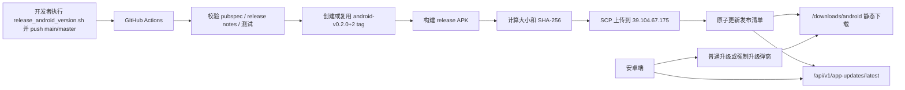

# DoorSix 自动发布与安卓版本升级技术实现设计

## 1. 文档目的

本文是 [自动发布与安卓版本升级需求](version-release-upgrade-requirements.md) 的技术实现设计。

实现目标：

- 分支 push 或手动触发后自动构建 Android release APK。
- APK 构建完成后自动上传到 `39.104.67.175`。
- 服务端提供版本发现接口和静态 APK 下载能力。
- 安卓端自动检查新版本，展示普通升级或强制升级提示。
- 每个需求点都有对应实现、测试和验收路径。

## 2. 当前工程基线

### 2.1 Flutter 端

- 当前版本配置在 `pubspec.yaml`：

```yaml
version: 0.1.0+1
```

- 业务后端地址通过 `DOORSIX_API_BASE_URL` 注入，默认值为 `http://39.104.67.175`。
- 已有 `shared_preferences`，可以直接用于保存升级检查状态。
- 当前没有读取 App 版本信息、打开浏览器链接、生命周期统一监听的更新模块。

### 2.2 服务端

- Node.js + Express 服务入口在 `server/src/index.js`。
- 现有部署脚本 `server/scripts/deploy.sh` 默认部署到 `39.104.67.175`。
- 当前未提供 `/api/v1/app-updates/latest` 和 `/api/v1/app-updates/releases/:platform/:versionCode`。
- 当前未暴露 `/downloads/android` 静态 APK 下载路径。

### 2.3 CI

- 已有 `.github/workflows/build-doorsix-apk.yml`。
- 当前 workflow 会在 `main/master`、PR、`doorsix-v*.*.*` tag 上构建 APK。
- 当前 tag 发布只创建 GitHub Release，不上传到 `39.104.67.175`。
- 新设计要求发布只由 `main/master` 分支 push 或 `workflow_dispatch` 触发；`android-v<versionName>+<versionCode>` tag 由 CI 自动创建或复用，只作为发布追溯记录，不作为发布触发源。

## 3. 总体架构



### 3.1 组件职责

| 组件 | 职责 |
| --- | --- |
| GitHub Actions | 校验、构建、测试、可选签名、上传、生成发布清单 |
| `scripts/prepare_android.sh` | 生成 Android scaffold 并补齐网络权限 |
| 新增 `scripts/publish_android_release.sh` | 本地和 CI 复用的 APK 上传、清单生成、远程校验脚本 |
| 远程服务器 `39.104.67.175` | 保存 APK、SHA-256、发布清单，并提供 HTTP 下载 |
| Express 服务端 | 暴露版本查询接口、读取发布清单、计算灰度和强制升级 |
| Flutter 更新模块 | 获取当前版本、请求版本接口、保存本地忽略状态、展示升级弹窗 |

## 4. 版本与 Tag 实现

### 4.1 版本解析

CI 使用 `pubspec.yaml` 中的 `version` 作为唯一版本来源。

解析规则：

```text
pubspec version: 0.2.0+2
versionName: 0.2.0
versionCode: 2
expected tag: android-v0.2.0+2
```

推荐在 CI 中使用 Dart 或 Node 脚本解析 YAML，避免用不稳定的字符串截取。

第一阶段可以新增脚本：

```text
scripts/print_flutter_version.js
```

输出：

```json
{
  "versionName": "0.2.0",
  "versionCode": 2,
  "pubspecVersion": "0.2.0+2",
  "expectedTag": "android-v0.2.0+2"
}
```

### 4.2 Tag 校验

正式发布只接受：

```text
android-v<versionName>+<versionCode>
```

校验规则：

- tag 不匹配 `^android-v[0-9]+\\.[0-9]+\\.[0-9]+\\+[0-9]+$` 时失败。
- tag 中的 `versionName` 必须等于 `pubspec.yaml` 的 `versionName`。
- tag 中的 `versionCode` 必须等于 `pubspec.yaml` 的 `versionCode`。
- `versionCode` 必须大于远程 `latest-android-stable.json` 中的 `versionCode`，除非是同版本幂等重跑且 SHA-256 一致。

### 4.3 当前 Workflow 改造

`.github/workflows/build-doorsix-apk.yml` 调整为：

- PR：只执行 `flutter analyze`、`flutter test`、构建验证，不发布。
- `main/master`：执行构建验证；如果 `pubspec.yaml` 版本大于线上 latest 且 release notes 存在，则自动发布。
- `android-v*` tag：不触发发布 workflow；tag 只作为追溯记录。
- 保留 `workflow_dispatch`：手动触发时输入 `expectedVersion`、`forceUpdate`、`minSupportedVersionCode`、`rolloutPercentage`。
- 手动触发时如果 `android-v<versionName>+<versionCode>` tag 不存在，CI 自动创建并推送 tag；如果 tag 已存在但不指向当前 commit，CI 必须失败。
- 兼容旧 `doorsix-v*` tag 的触发逻辑移除。
- 第一阶段固定发布 `stable/prod`，不提供 `internal/beta/staging` 隔离发布。

## 5. CI 自动发布设计

### 5.1 Workflow 输入

```yaml
workflow_dispatch:
  inputs:
    expectedVersion:
      type: string
      required: true
      description: "必须等于 pubspec.yaml version，例如 0.2.0+2"
    forceUpdate:
      type: boolean
      default: false
    minSupportedVersionCode:
      type: string
      default: "1"
    rolloutPercentage:
      type: string
      default: "100"
```

分支 push 自动发布时默认：

| 字段 | 默认值 |
| --- | --- |
| `channel` | `stable` |
| `environment` | `prod` |
| `forceUpdate` | `false` |
| `rolloutPercentage` | `100` |
| `minSupportedVersionCode` | 读取现有 latest 清单或默认 `1` |

手动触发时：

- GitHub Actions 页面选择要发布的 ref。
- `expectedVersion` 必须等于该 ref 中 `pubspec.yaml` 的 `version`。
- CI 计算对应 tag：`android-v<versionName>+<versionCode>`。
- 如果 tag 不存在，CI 自动创建并推送该 tag。
- 如果 tag 已存在且指向当前 commit，继续发布。
- 如果 tag 已存在但指向其他 commit，CI 必须失败。
- 发布前必须存在 `docs/release-notes/android/<versionName>+<versionCode>.md`，CI 从该文件生成清单 `releaseNotes` 和 GitHub Release 内容。

分支 push 时：

- CI 读取 `pubspec.yaml` 当前版本。
- CI 读取远程 `latest-android-stable.json` 当前版本。
- 如果当前 `versionCode` 没有大于 latest，CI 只保留构建验证结果并在 summary 中写明“版本未递增，跳过发布”。
- 如果当前 `versionCode` 大于 latest，CI 按正式发布流程继续执行。

### 5.2 CI Secret

| Secret | 用途 |
| --- | --- |
| `ANDROID_KEYSTORE_BASE64` | release 签名证书，第一阶段可选 |
| `ANDROID_KEYSTORE_PASSWORD` | 证书密码，第一阶段可选 |
| `ANDROID_KEY_ALIAS` | 签名别名，第一阶段可选 |
| `ANDROID_KEY_PASSWORD` | 签名别名密码，第一阶段可选 |
| `RELEASE_HOST` | 固定为 `39.104.67.175` |
| `RELEASE_USER` | SSH 用户 |
| `RELEASE_SSH_KEY` | SSH 私钥，优先使用 |
| `RELEASE_PASSWORD` | 仅在不能使用私钥时兜底 |
| `RELEASE_REMOTE_DIR` | 默认 `/opt/doorsix/releases` |
| `RELEASE_PUBLIC_BASE_URL` | 默认 `http://39.104.67.175/downloads/android` |

证书和 SSH 凭据不得写入仓库。

### 5.3 Release 签名

第一阶段为了支持随时发布新版本，不强制要求 release 签名证书。CI 可以直接构建当前可产出的 release APK 并上传发布。

如果配置了签名证书，则新增 CI 步骤：

1. 将 `ANDROID_KEYSTORE_BASE64` 解码到临时文件。
2. 生成 `android/key.properties`。
3. 如果 Android scaffold 是 CI 动态生成的，在 `prepare_android.sh` 之后注入 signing config。
4. 执行 `flutter build apk --release --dart-define=...`。
5. 构建完成后删除临时 keystore 和 `key.properties`。

如果第一阶段暂时没有 release 签名证书，CI 不因缺少签名 Secret 失败，但发布摘要和文档必须提示：不同签名的 APK 可能无法覆盖安装旧包，安装时可能需要先卸载旧版本。稳定 release 签名作为后续增强项。

### 5.4 构建命令

正式发布命令：

```bash
./scripts/prepare_android.sh
flutter pub get
flutter analyze
flutter test
flutter build apk --release \
  --dart-define=DOORSIX_API_BASE_URL=http://39.104.67.175 \
  --dart-define=DOORSIX_RELEASE_CHANNEL=stable
```

产物重命名：

```text
build/app/outputs/flutter-apk/door_six-0.2.0+2-stable.apk
```

### 5.5 上传脚本

新增：

```text
scripts/publish_android_release.sh
```

输入环境变量：

| 变量 | 说明 |
| --- | --- |
| `RELEASE_HOST` | `39.104.67.175` |
| `RELEASE_USER` | SSH 用户 |
| `RELEASE_REMOTE_DIR` | `/opt/doorsix/releases` |
| `RELEASE_PUBLIC_BASE_URL` | `http://39.104.67.175/downloads/android` |
| `APK_PATH` | 本地 APK 路径 |
| `VERSION_NAME` | 例如 `0.2.0` |
| `VERSION_CODE` | 例如 `2` |
| `RELEASE_CHANNEL` | 第一阶段固定为 `stable` |
| `RELEASE_ENVIRONMENT` | 第一阶段固定为 `prod` |
| `FORCE_UPDATE` | `true` 或 `false` |
| `MIN_SUPPORTED_VERSION_CODE` | 最低支持构建号 |
| `ROLLOUT_PERCENTAGE` | 0 到 100 |
| `RELEASE_NOTES_FILE` | `docs/release-notes/android/<versionName>+<versionCode>.md` |

脚本职责：

1. 计算 APK 字节数。
2. 计算 APK SHA-256。
3. 生成 `door_six-<versionName>+<versionCode>-<channel>.sha256`。
4. 读取发布说明文件，提取用户可见更新内容。
5. 生成 `release-android-<versionName>+<versionCode>.json`。
6. SSH 创建远程目录。
7. SCP 上传 APK、SHA-256、发布说明和清单到临时路径。
8. SSH 远程校验 SHA-256。
9. SSH 原子移动临时文件到正式路径。
10. SSH 原子更新 `latest-android-stable.json`。
11. HTTP GET 校验公开下载地址。

### 5.6 远程原子发布

远程写入必须先写临时文件：

```text
/opt/doorsix/releases/.tmp/<runId>/
```

校验通过后再执行：

```bash
mv tmp.apk android/0.2.0+2/door_six-0.2.0+2-stable.apk
mv tmp.sha256 android/0.2.0+2/door_six-0.2.0+2-stable.sha256
mv tmp.json manifests/release-android-0.2.0+2.json
mv tmp-latest.json manifests/latest-android-stable.json
```

这样可以避免客户端读到半个清单或半个 APK。

### 5.7 幂等重跑

同一个 tag 重跑时：

- 如果远程 APK 不存在，正常上传。
- 如果远程 APK 存在且 SHA-256 一致，允许重跑并重新校验 latest 清单。
- 如果远程 APK 存在但 SHA-256 不一致，CI 必须失败。
- 如果 latest 清单已经指向同版本且内容一致，视为成功。

### 5.8 失败处理

失败点和处理：

| 失败点 | 处理 |
| --- | --- |
| tag/pubspec 不一致 | CI 失败，不构建 |
| analyze/test 失败 | CI 失败，不构建发布包 |
| APK 构建失败 | CI 失败，不上传 |
| SCP 失败 | CI 失败，不更新 latest |
| 远程 SHA-256 校验失败 | 删除临时目录，CI 失败 |
| HTTP 下载校验失败 | 不更新 latest 或回滚 latest，CI 失败 |
| GitHub Release 创建失败 | 不回滚安卓发布，CI 标记 warning 并提示人工补建 release |

## 6. 服务器目录与静态下载设计

### 6.1 目录结构

远程服务器目录：

```text
/opt/doorsix/releases/
  android/
    0.2.0+2/
      door_six-0.2.0+2-stable.apk
      door_six-0.2.0+2-stable.sha256
  manifests/
    release-android-0.2.0+2.json
    latest-android-stable.json
  .tmp/
```

权限建议：

| 路径 | Owner | 权限 |
| --- | --- | --- |
| `/opt/doorsix/releases` | `doorsix` 或部署用户 | `0755` |
| APK 文件 | `doorsix` 或部署用户 | `0644` |
| 清单文件 | `doorsix` 或部署用户 | `0644` |
| `.tmp` | `doorsix` 或部署用户 | `0700` |

### 6.2 静态文件暴露

第一阶段优先复用 Node/Express 服务暴露静态目录，避免额外引入 Nginx 配置。

新增环境变量：

```text
APP_RELEASE_ANDROID_DIR=/opt/doorsix/releases/android
```

Express 注册：

```js
app.use(
  '/downloads/android',
  express.static(APP_RELEASE_ANDROID_DIR, {
    fallthrough: false,
    immutable: true,
    maxAge: '7d',
    setHeaders(res) {
      res.setHeader('X-Content-Type-Options', 'nosniff');
    },
  }),
);
```

后续如果接入 Nginx，可把 `/downloads/android` 改为 Nginx 静态目录，服务端版本接口不需要变更。

### 6.3 发布清单读取

新增环境变量：

```text
APP_UPDATE_MANIFEST_PATH=/opt/doorsix/releases/manifests/latest-android-stable.json
APP_UPDATE_MANIFEST_URL=
APP_UPDATE_ENVIRONMENT=prod
APP_UPDATE_DEFAULT_CHANNEL=stable
APP_UPDATE_DOWNLOAD_BASE_URL=http://39.104.67.175/downloads/android
```

服务端读取：

```text
/opt/doorsix/releases/manifests/latest-android-stable.json
```

读取策略：

- 第一阶段固定支持 `stable/prod`，直接读取 `APP_UPDATE_MANIFEST_PATH` 指向的 `latest-android-stable.json`。
- `APP_UPDATE_MANIFEST_URL` 作为后续迁移远程清单的预留项，第一阶段默认留空。
- 请求中的 `channel` 只接受 `stable` 或缺省值；`internal`、`beta` 和多环境隔离放到后续阶段。
- 每次请求读取清单，确保 CI 更新后立即生效。
- 文件读取失败返回 `hasUpdate=false`，并记录错误日志。
- JSON 解析失败返回 500，避免使用损坏清单误导客户端。
- 后续如流量变高，可以加 30 秒内存缓存和文件 mtime 校验。

## 7. 发布清单数据结构设计

### 7.1 清单字段

```json
{
  "id": "android-stable-2",
  "platform": "android",
  "channel": "stable",
  "environment": "prod",
  "versionName": "0.2.0",
  "versionCode": 2,
  "minSupportedVersionCode": 1,
  "forceUpdate": false,
  "status": "active",
  "title": "发现新版本 0.2.0",
  "releaseNotes": [
    "优化联机房间连接稳定性"
  ],
  "downloadUrl": "http://39.104.67.175/downloads/android/0.2.0+2/door_six-0.2.0+2-stable.apk",
  "fileSizeBytes": 32100000,
  "sha256": "replace-with-real-sha256",
  "gitTag": "android-v0.2.0+2",
  "commitSha": "replace-with-real-commit-sha",
  "publishedAt": "2026-05-09T12:00:00+08:00",
  "rollout": {
    "enabled": true,
    "percentage": 100
  }
}
```

### 7.2 字段校验

服务端启动或请求时校验：

| 字段 | 校验 |
| --- | --- |
| `platform` | 必须是 `android` |
| `channel` | 第一阶段必须是 `stable` |
| `environment` | 必须匹配当前 `APP_UPDATE_ENVIRONMENT` |
| `versionName` | 必须匹配 semver 三段式 |
| `versionCode` | 必须是正整数 |
| `minSupportedVersionCode` | 必须是正整数且小于等于 `versionCode` |
| `status` | 必须是 `draft`、`active`、`paused`、`recalled` |
| `downloadUrl` | 必须是 HTTP/HTTPS 绝对 URL |
| `fileSizeBytes` | 必须大于 0 |
| `sha256` | 必须是 64 位十六进制字符串 |
| `rollout.percentage` | 必须是 0 到 100 |

清单校验失败时：

- latest 查询返回 500。
- 服务端日志记录具体字段。
- 不返回损坏清单中的下载地址。

### 7.3 状态语义

| 状态 | 服务端处理 |
| --- | --- |
| `draft` | 不返回给客户端 |
| `active` | 可参与更新判断 |
| `paused` | 不返回给客户端 |
| `recalled` | 不返回给客户端，指定版本详情可返回但标注已撤回 |

## 8. 服务端接口实现设计

### 8.1 模块拆分

建议新增：

```text
server/src/app-update-service.js
server/test/app-update-service.test.js
```

`app-update-service.js` 暴露：

```js
loadLatestRelease({ platform, channel })
loadReleaseByVersionCode({ platform, versionCode })
decideUpdate({ release, clientVersionCode, deviceId, requestSeed })
isRolloutMatched({ release, deviceId, requestSeed })
validateRelease(release)
```

如果短期保持单文件服务端，也可以先把这些函数放在 `server/src/index.js`，但必须保持纯函数，方便后续测试。

### 8.2 最新版本接口

路由：

```text
GET /api/v1/app-updates/latest
```

请求参数：

| 参数 | 处理 |
| --- | --- |
| `platform` | 必须为 `android` |
| `channel` | 默认 `APP_UPDATE_DEFAULT_CHANNEL` |
| `versionCode` | 必须是整数 |
| `versionName` | 仅用于日志和兼容排查 |
| `deviceId` | 用于灰度分桶 |

响应直接返回需求文档中的结构，不包裹现有业务接口的 `success/data` 外层，降低安卓端更新检查的依赖复杂度：

```json
{
  "hasUpdate": true,
  "updateType": "optional",
  "latest": {
    "versionName": "0.2.0",
    "versionCode": 2,
    "title": "发现新版本 0.2.0",
    "releaseNotes": [],
    "downloadUrl": "http://39.104.67.175/downloads/android/0.2.0+2/door_six-0.2.0+2-stable.apk",
    "fileSizeBytes": 32100000,
    "sha256": "replace-with-real-sha256",
    "publishedAt": "2026-05-09T12:00:00+08:00"
  },
  "serverTime": "2026-05-09T12:00:00+08:00"
}
```

错误响应可以继续使用现有 `fail(req, res, status, code, message)` 格式，客户端按 HTTP 状态和 JSON 错误字段兜底。

### 8.3 指定版本详情接口

路由：

```text
GET /api/v1/app-updates/releases/:platform/:versionCode
```

用途：

- 运维排查发布记录。
- 手工验证某个构建号是否已上传。
- 测试清单读取逻辑。

返回字段：

- 发布记录完整字段。
- 如果状态为 `recalled`，仍可返回详情，但增加 `available=false`。
- 不返回任何密钥、CI Secret 或服务器内部路径。

### 8.4 更新判断算法

伪代码：

```js
function decideUpdate({ release, clientVersionCode, deviceId, requestSeed }) {
  if (!release) return { hasUpdate: false };
  if (release.status !== 'active') return { hasUpdate: false };
  if (!release.rollout?.enabled) return { hasUpdate: false };
  if (clientVersionCode >= release.versionCode) return { hasUpdate: false };
  if (!isRolloutMatched({ release, deviceId, requestSeed })) return { hasUpdate: false };

  const force =
    clientVersionCode < release.minSupportedVersionCode ||
    release.forceUpdate === true;

  return {
    hasUpdate: true,
    updateType: force ? 'force' : 'optional',
    latest: publicReleasePayload(release),
  };
}
```

### 8.5 灰度分桶

分桶输入：

```text
<platform>:<channel>:<versionCode>:<deviceId>
```

算法：

1. 使用 SHA-256 计算哈希。
2. 取前 8 位十六进制转整数。
3. 对 100 取模得到 `0..99` 桶。
4. `bucket < rollout.percentage` 即命中。

如果 `deviceId` 缺失：

- 使用 `x-forwarded-for + user-agent` 生成 `requestSeed` 兜底。
- 记录 warning 日志。
- 安卓端正常实现后必须始终传 `deviceId`。

### 8.6 缓存响应头

最新版本接口：

```text
Cache-Control: no-cache
```

指定版本详情接口：

```text
Cache-Control: no-cache
```

APK 静态下载：

```text
Cache-Control: public, max-age=604800, immutable
```

原因：

- 版本清单需要撤回后尽快生效。
- APK 文件带版本号路径，可以长期缓存。

### 8.7 业务接口版本不兼容

为后续协议不兼容预留服务端中间件：

客户端每个业务请求增加请求头：

```text
X-App-Platform: android
X-App-Version-Code: 2
X-App-Version-Name: 0.2.0
X-App-Channel: stable
```

服务端在关键业务接口前检查：

- 如果 `versionCode < minSupportedVersionCode`，返回 426。
- 错误码为 `APP_VERSION_UNSUPPORTED`。
- 响应包含 `minSupportedVersionCode`。

响应：

```json
{
  "success": false,
  "requestId": "req_xxx",
  "data": null,
  "error": {
    "code": "APP_VERSION_UNSUPPORTED",
    "message": "当前版本过低，请升级后继续使用。",
    "minSupportedVersionCode": 2
  }
}
```

## 9. Flutter 安卓端实现设计

### 9.1 新增依赖

建议新增，具体版本以实现时 `flutter pub add` 解析到的稳定版本为准：

```bash
flutter pub add package_info_plus url_launcher
```

用途：

- `package_info_plus` 读取 `versionName` 和 `versionCode`。
- `url_launcher` 打开 APK 下载地址或浏览器。
- `shared_preferences` 已存在，用于本地状态。

### 9.2 文件结构

新增文件：

```text
lib/models/app_update.dart
lib/services/app_update_service.dart
lib/services/app_update_state_store.dart
lib/widgets/app_update_gate.dart
lib/widgets/app_update_dialog.dart
```

改造文件：

```text
lib/main.dart
lib/pages/home_page.dart
lib/pages/online_room_page.dart
lib/services/online_table_service.dart
pubspec.yaml
```

### 9.3 数据模型

```dart
enum AppUpdateType {
  optional,
  force,
}

class AppUpdateInfo {
  const AppUpdateInfo({
    required this.type,
    required this.versionName,
    required this.versionCode,
    required this.title,
    required this.releaseNotes,
    required this.downloadUrl,
    required this.fileSizeBytes,
    required this.sha256,
    required this.publishedAt,
  });

  final AppUpdateType type;
  final String versionName;
  final int versionCode;
  final String title;
  final List<String> releaseNotes;
  final String downloadUrl;
  final int fileSizeBytes;
  final String sha256;
  final DateTime publishedAt;
}
```

### 9.4 更新服务

`AppUpdateService` 职责：

- 读取当前 App 版本。
- 读取 `DOORSIX_RELEASE_CHANNEL`。
- 获取或创建稳定匿名 `deviceId`。
- 请求 `/api/v1/app-updates/latest`。
- 解析 `hasUpdate`、`updateType` 和 `latest`。
- 处理网络失败并写入本地日志。

请求 URL 示例：

```text
GET /api/v1/app-updates/latest?platform=android&channel=stable&versionCode=1&versionName=0.1.0&deviceId=<uuid>
```

`deviceId` 生成策略：

- 第一次启动时生成随机 UUID 风格字符串。
- 保存到 `SharedPreferences`。
- 只用于灰度分桶。
- 不读取 IMEI、手机号、通讯录、Android ID。

### 9.5 本地状态存储

`AppUpdateStateStore` 使用以下 key：

```text
app_update.device_id
app_update.last_check_at
app_update.dismissed_version_code
app_update.dismissed_at
app_update.force_locked_version_code
```

普通更新节流：

```dart
bool shouldShowOptionalUpdate(AppUpdateInfo info, DateTime now) {
  if (info.type == AppUpdateType.force) return true;
  if (dismissedVersionCode != info.versionCode) return true;
  if (dismissedAt == null) return true;
  return now.difference(dismissedAt!) >= const Duration(hours: 24);
}
```

强制更新：

- 保存 `force_locked_version_code`。
- 每次启动和回前台都优先检查强制锁定。
- 如果服务端返回无强制更新或版本已升级，清理锁定状态。

### 9.6 生命周期检查

新增 `AppUpdateGate` 包裹整个 App：

```dart
MaterialApp.router(
  builder: (context, child) {
    return AppUpdateGate(child: child ?? const SizedBox.shrink());
  },
  routerConfig: _router,
)
```

`AppUpdateGate`：

- `initState` 后 `addPostFrameCallback` 执行冷启动检查。
- 实现 `WidgetsBindingObserver`。
- 在 `AppLifecycleState.resumed` 时判断距离 `lastUpdateCheckAt` 是否超过 30 分钟。
- 避免同时弹多个更新弹窗。
- 强制更新弹窗使用不可关闭 barrier。

### 9.7 检查时机实现

| 时机 | 实现 |
| --- | --- |
| 冷启动 | `AppUpdateGate.initState` 第一帧后异步检查 |
| 回到前台 | `didChangeAppLifecycleState(resumed)`，超过 30 分钟检查 |
| 手动检查 | 首页设置按钮弹出菜单，增加“检查更新” |
| 版本不兼容错误 | 捕获 `DoorSixBackendException.code == APP_VERSION_UNSUPPORTED` 后触发强制检查 |

手动检查需要忽略 24 小时稍后提醒节流，但不忽略服务端灰度结果。

### 9.8 普通升级弹窗

组件：

```text
AppUpdateDialog.optional(info)
```

UI 内容：

- 标题：使用服务端 `title` 或 `发现新版本 <versionName>`。
- 更新内容：`releaseNotes` 列表。
- 安装包大小：格式化为 MB。
- “稍后”按钮。
- “立即升级”按钮。

交互：

- “稍后”：保存 `dismissedVersionCode` 和 `dismissedAt`，关闭弹窗。
- “立即升级”：调用 `launchUrl(downloadUrl, mode: LaunchMode.externalApplication)`。
- 打开失败：显示 SnackBar，不影响继续使用。

### 9.9 强制升级弹窗

组件：

```text
AppUpdateDialog.force(info)
```

UI 内容：

- 标题：使用服务端 `title` 或 `必须升级后继续使用`。
- 强制升级原因或更新内容。
- 安装包大小。
- “立即升级”按钮。

交互：

- `barrierDismissible=false`。
- 不展示“稍后”。
- 物理返回键不关闭，使用 `PopScope(canPop: false)`。
- 下载失败时停留弹窗并允许重试。
- 强制升级期间锁定整个 App，使用全屏遮罩阻止首页、人机练习、创建房间、加入房间和联机牌桌等所有核心操作。

### 9.10 下载与安装

第一阶段只打开外部浏览器：

```dart
await launchUrl(
  Uri.parse(info.downloadUrl),
  mode: LaunchMode.externalApplication,
);
```

不在第一阶段实现：

- App 内下载进度。
- 断点续传。
- 安装权限引导。
- 下载完成自动安装。
- 国内安卓应用市场跳转。

不过保留 `sha256` 字段，为后续 App 内下载校验做准备。

后续如果发布到应用市场，`latest` 响应可以扩展：

```json
{
  "marketUrls": {
    "huawei": "appmarket://details?id=...",
    "xiaomi": "mimarket://details?id=...",
    "browser": "https://..."
  }
}
```

安卓端优先尝试对应市场 deep link，失败时回退到 `downloadUrl`。

### 9.11 业务请求版本头

`DoorSixBackendClient` 增加可选 `AppClientInfoProvider`：

```dart
request.headers.set('X-App-Platform', 'android');
request.headers.set('X-App-Version-Code', versionCode.toString());
request.headers.set('X-App-Version-Name', versionName);
request.headers.set('X-App-Channel', releaseChannel);
```

如果版本信息还未初始化，业务请求仍可继续发送；初始化后自动携带。

### 9.12 联机不兼容错误处理

`online_room_page.dart` 当前已经捕获并展示后端错误。改造为：

- 当错误码为 `APP_VERSION_UNSUPPORTED`：
  - 不只展示普通 SnackBar。
  - 调用 `AppUpdateGate.checkNow(force: true)` 或全局 `AppUpdateController.checkNow(force: true)`。
  - 如果版本接口失败，展示“当前版本过低，请稍后重试或重新打开 App 检查更新”。

## 10. 配置实现

### 10.1 CI 配置

CI 环境变量映射：

| 需求配置 | 实现位置 |
| --- | --- |
| `FLUTTER_VERSION` | workflow env，默认 `3.41.9` |
| Android 签名配置 | GitHub Secrets，第一阶段可选 |
| `DOORSIX_API_BASE_URL` | `flutter build --dart-define` |
| `RELEASE_HOST` | GitHub Secret，默认 `39.104.67.175` |
| `RELEASE_USER` | GitHub Secret |
| `RELEASE_SSH_KEY` | GitHub Secret |
| `RELEASE_REMOTE_DIR` | workflow env，默认 `/opt/doorsix/releases` |
| `RELEASE_PUBLIC_BASE_URL` | workflow env，默认 `http://39.104.67.175/downloads/android` |
| `RELEASE_CHANNEL` | workflow input |

### 10.2 服务端配置

`server/scripts/deploy.sh` 增加写入：

```text
APP_UPDATE_MANIFEST_PATH=/opt/doorsix/releases/manifests/latest-android-stable.json
APP_UPDATE_MANIFEST_URL=
APP_RELEASE_ANDROID_DIR=/opt/doorsix/releases/android
APP_UPDATE_ENVIRONMENT=prod
APP_UPDATE_DEFAULT_CHANNEL=stable
APP_UPDATE_DOWNLOAD_BASE_URL=http://39.104.67.175/downloads/android
```

部署脚本还要创建：

```bash
mkdir -p /opt/doorsix/releases/android /opt/doorsix/releases/manifests /opt/doorsix/releases/.tmp
chown -R doorsix:doorsix /opt/doorsix/releases
```

### 10.3 安卓端配置

Flutter 构建参数：

```bash
--dart-define=DOORSIX_API_BASE_URL=http://39.104.67.175
--dart-define=DOORSIX_RELEASE_CHANNEL=stable
```

读取方式：

```dart
const releaseChannel = String.fromEnvironment(
  'DOORSIX_RELEASE_CHANNEL',
  defaultValue: 'stable',
);
```

## 11. 安全设计

### 11.1 下载安全

- 发布清单包含 APK SHA-256。
- CI 上传前后分别计算 SHA-256。
- 服务端只返回清单中的 `downloadUrl`，客户端不拼接下载地址。
- `recalled` 状态版本不出现在 latest 查询结果中。
- APK 静态下载目录只允许读取，不允许 HTTP 写入。

### 11.2 凭据安全

- SSH 私钥、服务器密码、签名证书全部放 CI Secret。
- CI 日志不得打印 Secret 原文。
- 上传脚本打印下载地址和 SHA-256，但不打印私钥路径内容。
- 临时 keystore 构建后删除。

### 11.3 HTTPS 规划

第一阶段明确支持 HTTP 下载。当前服务器和 App 默认使用 `http://39.104.67.175`，APK 下载地址使用 `http://39.104.67.175/downloads/android/...`。

技术预留：

- `RELEASE_PUBLIC_BASE_URL` 和 `DOORSIX_API_BASE_URL` 都通过配置注入。
- 后续部署域名和证书后切换为 HTTPS，不需要重新设计协议。
- 切到 HTTPS 后移除 `prepare_android.sh` 中的 `usesCleartextTraffic`。

## 12. 日志与观测

### 12.1 CI 日志

每次发布输出：

- tag。
- commit SHA。
- `versionName` / `versionCode`。
- APK 文件名。
- APK 字节数。
- SHA-256。
- 远程目录。
- 公开下载地址。
- latest 清单路径。

### 12.2 服务端日志

版本接口日志包含：

- `requestId`。
- `platform`、`channel`、`versionCode`、`versionName`。
- 是否命中灰度。
- 返回 `hasUpdate` 和 `updateType`。
- 清单读取或校验错误。

不得记录敏感设备标识原文。`deviceId` 只记录哈希前 8 位。

### 12.3 安卓端日志

复用现有 `ServerLogStore` 或新增轻量日志：

| 事件 | 记录内容 |
| --- | --- |
| `app_update_check_started` | 当前版本、渠道、触发来源 |
| `app_update_check_succeeded` | 是否有更新、更新类型、目标版本 |
| `app_update_check_failed` | 错误类型，不含敏感信息 |
| `app_update_prompt_shown` | 更新类型、目标版本 |
| `app_update_dismissed` | 目标版本 |
| `app_update_download_clicked` | 目标版本和下载域名 |
| `app_update_forced` | 当前版本、最低版本 |

## 13. 测试设计

### 13.1 测试原则

自动发布升级链路同时影响 CI、服务器、服务端接口和安卓端弹窗。测试必须满足：

- 第一阶段只支持 `stable/prod`，测试发布也使用正式目录和 `latest-android-stable.json`。
- 默认不覆盖正式 APK 目录中的历史版本文件。
- 每个测试发布都必须使用递增版本号、独立 tag 和测试报告。
- 测试失败不影响当前线上版本检查、房间创建、加入房间和 WebSocket 牌桌主流程。
- 测试完成后必须生成 Markdown 测试报告，报告里记录版本、环境、产物、用例结果和结论。

### 13.2 测试隔离策略

第一阶段不使用 `/downloads/android-test` 或 `internal/staging` 隔离链路。所有发布统一写入正式目录：

推荐发布目录：
```text
/opt/doorsix/releases/
  android/
    0.2.0+2/
      door_six-0.2.0+2-stable.apk
      door_six-0.2.0+2-stable.sha256
  manifests/
    release-android-0.2.0+2.json
    latest-android-stable.json
  test-reports/
    app-update-release-test-20260509-120000.md
```

测试隔离依赖以下规则：

- 测试版本号必须递增，不能覆盖历史版本目录。
- 发布前记录当前 `latest-android-stable.json` 的版本号和 SHA-256。
- 测试失败时把 latest 清单改回上一个可用版本，或把当前清单状态改为 `paused` / `recalled`。
- 主体流程回归通过前，不把本次发布视为可继续分发版本。

构建参数：

```bash
flutter build apk --release \
  --dart-define=DOORSIX_API_BASE_URL=http://39.104.67.175 \
  --dart-define=DOORSIX_RELEASE_CHANNEL=stable
```

### 13.3 测试数据与测试设备

测试设备要求：

- 至少 1 台低版本安卓设备或模拟器，安装旧版本 APK。
- 至少 1 台当前版本安卓设备或模拟器，用于验证无更新。
- 至少 1 台测试设备使用固定匿名 `deviceId`，用于灰度命中验证。

测试版本要求：

| 类型 | 示例 | 用途 |
| --- | --- | --- |
| 旧版本 | `0.1.0+1` | 验证普通升级和强制升级 |
| 新版本 | `0.2.0+2` | 作为 latest 清单目标 |
| 当前版本 | `0.2.0+2` | 验证无更新 |

第一阶段测试清单仍使用 `stable/prod`。测试版本进入可继续分发前，必须完成端到端验证和主体流程回归。

### 13.4 CI 测试

新增脚本测试：

- `pubspec.yaml` 版本解析。
- tag 与版本不一致时失败。
- 发布清单生成字段完整。
- push 时版本未递增只构建不发布，并写入 CI summary。
- 远程已存在同 SHA-256 文件时允许重跑。
- 远程已存在不同 SHA-256 文件时失败。
- 分支 push 或手动发布没有 tag 时会自动创建 `android-v<versionName>+<versionCode>` tag。
- tag 已存在但指向其他 commit 时发布失败。
- `android-v*` tag push 不触发发布 workflow。
- 缺少 `docs/release-notes/android/<versionName>+<versionCode>.md` 时发布失败。
- 下载地址 HTTP 校验失败时不会更新 latest 清单。

CI 测试命令建议：

```bash
npm --prefix server test
flutter analyze
flutter test
```

发布脚本测试可以新增：

```bash
scripts/publish_android_release.sh --dry-run
scripts/publish_android_release.sh --verify-only
```

`--dry-run` 只生成 APK 元数据、SHA-256 和清单，不上传服务器。

`--verify-only` 只校验远程 APK、SHA-256、latest 清单和下载地址，不修改任何远程文件。

### 13.5 服务端单元测试

覆盖：

- `clientVersionCode >= latest.versionCode` 返回无更新。
- `clientVersionCode < latest.versionCode` 返回普通更新。
- `clientVersionCode < minSupportedVersionCode` 返回强制更新。
- `forceUpdate=true` 返回强制更新。
- `rollout.enabled=false` 返回无更新。
- `rollout.percentage=0` 返回无更新。
- `rollout.percentage=100` 全部命中。
- `draft`、`paused`、`recalled` 不返回 latest。
- 清单字段缺失或 SHA-256 非法时失败。
- `channel` 缺省或为 `stable` 时读取 `latest-android-stable.json`。
- `channel=internal` 或 `beta` 在第一阶段返回参数错误或按未支持渠道处理。
- `environment` 固定校验为 `prod`。
- `deviceId` 相同且版本相同时灰度命中结果稳定。

### 13.6 服务端集成测试

新增测试 fixture：

```text
server/test/fixtures/app-updates/latest-android-stable.json
```

集成测试启动服务时设置：

```text
APP_UPDATE_MANIFEST_PATH=<fixture-dir>/latest-android-stable.json
APP_RELEASE_ANDROID_DIR=<fixture-apk-dir>
```

验证：

- `/api/v1/app-updates/latest` 响应结构。
- `/api/v1/app-updates/releases/android/2` 响应详情。
- `/downloads/android/...apk` 可访问测试文件。
- 损坏清单不会返回下载地址。
- `latest-android-stable.json` 不存在时返回无更新并记录错误。
- `channel=internal` 或 `beta` 不会读取其他 latest 文件。
- `APP_VERSION_UNSUPPORTED` 响应能够携带 `minSupportedVersionCode`。

### 13.7 Flutter 单元测试

覆盖：

- 版本接口响应解析。
- 无更新响应解析。
- 普通更新 24 小时节流。
- 手动检查忽略节流。
- 更高版本发布后重新提示。
- 强制更新不允许稍后。
- 下载 URL 打开失败时返回错误状态。
- `DOORSIX_RELEASE_CHANNEL=stable` 时请求 stable 渠道。
- 版本接口失败时不阻塞普通首页展示。
- `APP_VERSION_UNSUPPORTED` 能触发强制更新检查。

### 13.8 Flutter Widget 测试

覆盖：

- 普通升级弹窗展示标题、内容、大小、稍后、立即升级。
- 强制升级弹窗不展示稍后。
- 强制升级弹窗不能通过返回键关闭。
- 首页设置入口可以触发手动检查。
- 无更新时不展示弹窗。
- 版本接口失败时不遮挡首页和联机入口。

### 13.9 端到端验证流程

第一阶段端到端测试直接使用 `stable/prod` 链路。测试版本必须递增版本号，并在测试前记录当前 latest 清单，失败时通过暂停、撤回或指回上一个版本恢复。

#### 13.9.1 测试发布准备

1. 确认当前线上 `latest-android-stable.json` 的 SHA-256 和版本号。
2. 创建测试版本，例如 `0.2.0+2`。
3. 使用手动 workflow，输入：
   - `expectedVersion=0.2.0+2`
   - `forceUpdate=false`
   - `rolloutPercentage=100`
4. 确认存在 `docs/release-notes/android/0.2.0+2.md`。
5. CI 自动创建或复用 `android-v0.2.0+2` tag。
6. CI 构建 APK，并上传到正式 `/downloads/android/0.2.0+2/` 目录。
7. CI 更新 `latest-android-stable.json`。

#### 13.9.2 服务端验证

执行：

```bash
curl -fsS "http://39.104.67.175/api/v1/app-updates/latest?platform=android&channel=stable&versionCode=1&versionName=0.1.0&deviceId=test-device-001"
curl -fsS "http://39.104.67.175/downloads/android/0.2.0+2/door_six-0.2.0+2-stable.apk" -o /tmp/doorsix-test.apk
```

预期：

- stable 返回 `hasUpdate=true`。
- APK 下载成功。
- 下载文件 SHA-256 与清单一致。

#### 13.9.3 安卓端验证

1. 安装旧版本 `0.1.0+1`。
2. 冷启动 App，确认首页先正常展示，再异步弹出普通升级提示。
3. 点击“稍后”，重启 App，确认 24 小时内不重复弹同一版本。
4. 手动点击“检查更新”，确认可以再次展示该版本。
5. 点击“立即升级”，确认外部浏览器打开 APK 下载地址。
6. 将 stable 清单改为 `forceUpdate=true`，重新启动旧版本 App。
7. 确认强制升级弹窗不可关闭，整个 App 不可继续使用。
8. 将 stable 清单设置为 `rollout.percentage=0`，确认不再提示。
9. 将下载地址临时改为不可访问，确认点击立即升级后显示错误且 App 不崩溃。

#### 13.9.4 主体流程无影响验证

测试过程中必须额外验证主体流程：

1. 使用正式 stable 包或当前开发包启动 App。
2. 创建房间。
3. 加入房间。
4. WebSocket 连接成功。
5. 准备、开局、出牌或过牌至少完成一轮。
6. 查询 `/health` 正常。
7. 检查测试完成后 `latest-android-stable.json` 已指向可继续分发版本，或已按结论暂停/撤回。

如果任一主体流程失败，本次测试结论为不通过，即使升级弹窗本身通过。

### 13.10 手工验收

流程：

1. 安装 `0.1.0+1`。
2. 执行发布脚本发布 `0.2.0+2`，CI 自动创建或复用 `android-v0.2.0+2` tag。
3. 确认 APK 出现在 `http://39.104.67.175/downloads/android/0.2.0+2/...apk`。
4. 冷启动 App，确认出现普通升级弹窗。
5. 点击“稍后”，重启 App，确认 24 小时内不重复弹。
6. 修改 latest 清单为强制升级，确认无法关闭弹窗继续使用。
7. 设置 `rollout.percentage=0`，确认不提示更新。
8. 设置下载地址为不可访问，确认点击立即升级后展示错误。

### 13.11 测试报告生成

测试完成后必须生成 Markdown 报告。

推荐本地报告路径：

```text
docs/test-reports/app-update-release-test-YYYYMMDD-HHMMSS.md
```

推荐服务器报告路径：

```text
/opt/doorsix/releases/test-reports/app-update-release-test-YYYYMMDD-HHMMSS.md
```

CI 同时将报告上传为 workflow artifact。

报告生成方式：

1. CI 自动收集版本、commit、tag、APK 路径、SHA-256、下载地址、清单路径。
2. 自动写入 CI 测试、服务端测试和 Flutter 测试结果。
3. 手工测试人员补充设备信息、截图路径、手工用例结果和结论。
4. 报告结论必须是 `PASS`、`FAIL` 或 `BLOCKED`。

报告模板：

```markdown
# DoorSix 自动发布升级测试报告

## 1. 测试结论

- 结论：PASS / FAIL / BLOCKED
- 测试时间：2026-05-09 12:00:00 +08:00
- 测试人员：
- 影响范围：stable / prod

## 2. 版本与产物

| 项目 | 值 |
| --- | --- |
| Git tag | android-v0.2.0+2 |
| Commit | replace-with-commit |
| versionName | 0.2.0 |
| versionCode | 2 |
| Channel | stable |
| Environment | prod |
| APK | door_six-0.2.0+2-stable.apk |
| SHA-256 | replace-with-sha256 |
| Download URL | http://39.104.67.175/downloads/android/0.2.0+2/door_six-0.2.0+2-stable.apk |
| Manifest | latest-android-stable.json |

## 3. 自动化测试结果

| 测试项 | 结果 | 说明 |
| --- | --- | --- |
| flutter analyze | PASS |  |
| flutter test | PASS |  |
| server unit test | PASS |  |
| server integration test | PASS |  |
| publish dry-run | PASS |  |
| remote verify-only | PASS |  |

## 4. 服务端接口验证

| 用例 | 请求 | 预期 | 实际 | 结果 |
| --- | --- | --- | --- | --- |
| stable 旧版本发现更新 | `/api/v1/app-updates/latest?...channel=stable&versionCode=1` | optional | optional | PASS |
| 当前版本无更新 | `/api/v1/app-updates/latest?...channel=stable&versionCode=2` | `hasUpdate=false` |  |  |
| APK 下载 | Download URL | 200 | 200 | PASS |
| SHA-256 校验 | sha256sum | 与清单一致 | 一致 | PASS |

## 5. 安卓端验证

| 用例 | 设备 | 预期 | 实际 | 结果 |
| --- | --- | --- | --- | --- |
| 冷启动检查 |  | 首页正常展示后弹窗 |  |  |
| 稍后提醒节流 |  | 24 小时内不重复弹 |  |  |
| 手动检查 |  | 可再次展示更新 |  |  |
| 立即升级 |  | 打开下载地址 |  |  |
| 强制升级 |  | 不可关闭并阻止整个 App 使用 |  |  |
| 下载失败 |  | 展示错误且不崩溃 |  |  |

## 6. 主体流程回归

| 用例 | 预期 | 实际 | 结果 |
| --- | --- | --- | --- |
| 健康检查 | `/health` 正常 |  |  |
| 创建房间 | 成功 |  |  |
| 加入房间 | 成功 |  |  |
| WebSocket 连接 | 成功 |  |  |
| 准备/开局/出牌 | 至少一轮成功 |  |  |
| stable 清单状态正确 | 指向可继续分发版本或已暂停/撤回 |  |  |

## 7. 问题记录

| 编号 | 严重级别 | 问题 | 处理状态 |
| --- | --- | --- | --- |

## 8. 发布建议

- 是否允许进入 stable：是 / 否
- 需要先修复的问题：
```

### 13.12 测试准入与退出规则

准入条件：

- 需求文档和技术设计已更新。
- 测试版本号已递增。
- 测试设备已安装旧版本。
- 当前 `latest-android-stable.json` 已备份或记录 SHA-256。
- 对应版本的 `docs/release-notes/android/<versionName>+<versionCode>.md` 已提交。

退出条件：

- 自动化测试全部通过。
- 端到端测试通过。
- 主体流程回归通过。
- 测试报告结论为 `PASS`。
- 如果结论为 `FAIL` 或 `BLOCKED`，必须暂停、撤回或指回上一个可用 stable/prod latest 清单。

### 13.13 测试完成后的清理

测试完成后：

- 保留测试 APK 和清单至少 7 天用于排查。
- 如果测试结论不是 `PASS`，将 `latest-android-stable.json` 的 `rollout.enabled` 改为 `false`、状态改为 `paused/recalled`，或指回上一个可用版本。
- 不删除正式版本文件。
- 将测试报告提交到 `docs/test-reports/`，或作为 CI artifact 保存。

## 14. 发布与回滚设计

### 14.1 正常发布

1. 修改代码并更新 `pubspec.yaml` 版本。
2. 合并到主分支。
3. 准备 `docs/release-notes/android/0.2.0+2.md`。
4. 执行 `scripts/release_android_version.sh 0.2.0+2 "<发布说明>"`，由脚本提交并 push 分支，再由 CI 自动创建或复用 tag。
5. CI 构建、测试、上传 APK。
6. CI 更新 `latest-android-stable.json`。
7. 安卓端通过版本接口发现新版本。

### 14.2 暂停灰度

修改远程 latest 清单：

```json
"rollout": {
  "enabled": false,
  "percentage": 0
}
```

或将状态改为：

```json
"status": "paused"
```

客户端下一次检查后不再提示该版本。

### 14.3 撤回版本

撤回步骤：

1. 将对应 release 清单 `status` 改为 `recalled`。
2. 将 `latest-android-stable.json` 指向上一个可用版本，或改为 `recalled`。
3. 保留 APK 文件用于排查，不删除历史产物。
4. 如有严重问题，设置新版本 `forceUpdate=true` 并提高 `minSupportedVersionCode`。

### 14.4 强制升级误配置回滚

如果误设置强制升级：

1. 将 latest 清单中的 `forceUpdate=false`。
2. 将 `minSupportedVersionCode` 降回正确值。
3. 更新 `publishedAt` 或保留原值均可，客户端下一次检查会解除锁定。
4. 安卓端收到非强制结果后清理 `force_locked_version_code`。

## 15. 分阶段实现计划

### 阶段一：最小闭环

改动：

- 新增发布脚本。
- 改造 GitHub Actions tag 规则和服务器上传。
- 服务端新增版本接口。
- 服务端暴露 `/downloads/android`。
- Flutter 新增冷启动检查和升级弹窗。
- 首页设置入口支持手动检查。

完成标准：

- `android-v0.2.0+2` tag 可以构建并上传 APK 到 `39.104.67.175`。
- 旧版 App 可以看到普通升级提示。
- 强制升级清单可以阻止继续使用核心功能。

### 阶段二：质量增强

改动：

- 增加灰度百分比管理。
- 增加发布状态管理脚本。
- 增加服务端和 Flutter 测试覆盖。
- GitHub Release 附加 APK 和发布清单。

### 阶段三：体验增强

改动：

- 设置页正式增加“检查更新”。
- App 内下载进度。
- 下载完成后校验 SHA-256。
- Android 安装权限引导。
- 国内安卓应用市场 deep link 和浏览器兜底。
- HTTPS 切换。

## 16. 需求覆盖矩阵

| 需求点 | 实现设计 |
| --- | --- |
| 代码侧自动构建、发布安卓包 | GitHub Actions 分支 push/manual 触发，执行 analyze/test/build/upload |
| 服务端提供最新版本信息 | 新增 `/api/v1/app-updates/latest` 和清单读取服务 |
| 安卓端启动自动发现新版本 | `AppUpdateGate` 冷启动第一帧后检查 |
| 安卓端回前台自动发现新版本 | `WidgetsBindingObserver` 在 resumed 后按 30 分钟节流检查 |
| 安卓端提示是否升级 | `AppUpdateDialog.optional` 展示稍后和立即升级 |
| 普通升级可稍后 | 保存 `dismissedVersionCode` 和 `dismissedAt` |
| 强制升级 | `updateType=force`，不可关闭弹窗，锁定整个 App |
| 升级提示展示版本号、更新内容、安装包大小 | 弹窗读取 `versionName`、`releaseNotes`、`fileSizeBytes` |
| 同一版本不频繁打扰 | 24 小时节流逻辑 |
| 发布流程自动化 | `publish_android_release.sh` 统一上传和清单更新 |
| 发布可追溯 | 清单包含 tag、commit、APK、SHA-256、发布时间 |
| APK 上传到 `39.104.67.175` | CI 通过 SSH/SCP 上传到 `/opt/doorsix/releases/android` |
| 安卓端不写死最新版本 | 只请求服务端版本接口，客户端只知道当前版本 |
| 灰度 | 服务端基于 `deviceId` SHA-256 分桶 |
| 最低可用版本 | 清单 `minSupportedVersionCode` 和服务端判断 |
| 多环境和渠道 | 第一阶段固定 `stable/prod`，其他渠道和环境后续扩展 |
| 发布失败不污染线上 | 上传临时目录、远程校验、原子更新 latest |
| 不做应用商店内更新 | 第一阶段只打开 APK 下载 URL |
| 不做 iOS | 接口和 CI 限定 `platform=android` |
| 不做热更新 | 发布完整 APK，不下发动态代码 |
| 不做账号级推送 | 使用匿名 `deviceId` 和渠道灰度 |
| 不做复杂 A/B | 只支持灰度百分比 |
| `versionName` / `versionCode` | 从 `pubspec.yaml` 解析并校验 tag |
| tag 命名 | CI 强制 `android-v<versionName>+<versionCode>` |
| Git tag 触发 | 不启用发布；`android-v*` tag 只作为追溯记录 |
| 手动触发 | `workflow_dispatch` 输入 `expectedVersion` 和发布参数，必要时自动创建 tag |
| 分支 push 触发 | `main/master` push 时版本递增则发布，版本未递增则只构建验证 |
| main 不污染正式版本 | main 只构建 artifact，不更新 latest |
| 产物包含 APK/SHA/清单/说明 | CI 生成并上传四类产物 |
| 发布状态 | 清单 `draft/active/paused/recalled`，服务端只返回 active |
| 测试失败不发布 | analyze/test 在上传前执行 |
| 上传失败不更新版本信息 | 脚本只在上传和远程校验成功后 mv latest |
| 下载地址校验失败不更新 | HTTP 校验在 latest 更新前或失败时回滚 |
| 重跑同 tag 幂等 | 同 SHA 允许重跑，不同 SHA 失败 |
| 最新版本查询参数 | 服务端解析 `platform/channel/versionCode/versionName/deviceId` |
| 无更新响应 | `hasUpdate=false` |
| 普通更新响应 | `hasUpdate=true`、`updateType=optional` |
| 强制更新响应 | `hasUpdate=true`、`updateType=force` |
| 灰度 0/100 | 分桶逻辑和测试覆盖 |
| 服务端 no-cache | 版本接口设置 `Cache-Control: no-cache` |
| 版本接口失败不阻断普通使用 | Flutter 捕获异常，只记录日志 |
| 手动检查更新 | 首页设置入口触发 `checkNow(manual: true)` |
| 业务接口版本不兼容 | 服务端返回 `APP_VERSION_UNSUPPORTED`，Flutter 触发强制检查 |
| 本地状态字段 | `SharedPreferences` 保存四类状态和匿名设备 ID |
| 外部浏览器下载 APK | `url_launcher` externalApplication |
| 下载失败提示 | `launchUrl` 失败展示 SnackBar |
| 后续 App 内下载能力 | 阶段三预留下载进度、SHA 校验、安装权限 |
| 国内安卓应用市场跳转 | 阶段三预留 `marketUrls` 和 deep link 兜底 |
| APK 下载支持 HTTP | 第一阶段明确支持 `http://39.104.67.175`，后续预留 HTTPS |
| 发布清单包含 SHA-256 | CI 生成 SHA-256 并写入清单 |
| 服务端不返回 recalled | 状态过滤 |
| 客户端不拼接下载地址 | 使用服务端返回 `downloadUrl` |
| 不泄露内部信息 | 指定版本详情过滤 Secret 和内部路径 |
| CI 配置项 | workflow env/input/secrets 映射 |
| 服务端配置项 | `deploy.sh` 写入 APP_UPDATE 配置 |
| 安卓端配置项 | `DOORSIX_API_BASE_URL`、`DOORSIX_RELEASE_CHANNEL` |
| 服务端发布记录结构 | 清单 schema 定义 |
| 安卓端模型 | `AppUpdateInfo` 和 `AppUpdateType` |
| 埋点与日志 | CI、服务端、安卓端日志事件 |
| 自动发布验收 | CI 测试和手工发布流程覆盖 |
| 服务端验收 | 单元测试和集成测试覆盖 |
| 安卓端验收 | 单元、Widget 和手工测试覆盖 |
| 不影响主体流程的测试 | 使用递增版本号、清单备份、暂停/撤回和主体流程回归控制风险 |
| 测试期间验证主体流程完好 | 回归 `/health`、创建房间、加入房间、WebSocket、准备/开局/出牌 |
| 测试完成生成报告 | 生成 `docs/test-reports/app-update-release-test-YYYYMMDD-HHMMSS.md` 并上传 CI artifact |
| 测试准入与退出 | 定义准入条件、退出条件，`FAIL/BLOCKED` 必须暂停、撤回或指回上一个版本 |
| 测试后清理 | 保留测试产物至少 7 天，不删除正式版本，失败时恢复 stable latest |
| 分阶段落地 | 阶段一、二、三计划 |
| 风险应对 | 原子发布、版本递增、draft/active、稳定分桶、Secret 管理 |

## 17. 自查结论

本文已逐项覆盖需求文档中的自动发布、服务器上传、版本发现、灰度、强制升级、安卓交互、本地状态、配置、安全、日志、测试、验收和分阶段落地要求。

已确认的一期工程决策：

- 第一阶段只支持 `stable/prod`，不做 `internal/beta/staging` 发布隔离。
- 第一阶段允许未统一 release 签名的 APK 先发布，签名能力后续增强。
- 第一阶段支持 HTTP 下载，后续再切 HTTPS。
- 强制升级锁定整个 App。
- 手动发布无 tag 时由 CI 自动创建 `android-v<versionName>+<versionCode>` tag。
- 第一阶段不使用 `/downloads/android-test`，所有 APK 走正式 `/downloads/android` 目录。
- 发布说明固定维护在 `docs/release-notes/android/<versionName>+<versionCode>.md`。
